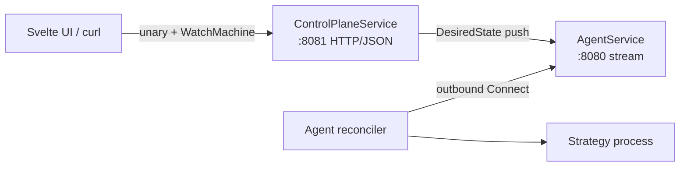

# Strategon

An internal platform for registering trading machines and publishing/supervising
strategy processes, built on **level-triggered desired-state convergence**
(kubelet-inspired): publish, rollback, and disaster recovery are unified into one
mechanism — change the desired state and let the agent converge.

Design docs: `ARCHITECTURE.md`, `PROTOCOL.md`, `RECONCILER.md`, `SAFETY.md`,
`FRONTEND.md`.

## Status

Foundation (agent reconciler + agent stream) plus the **human API and Svelte UI**
(`FRONTEND.md`): Connect `ControlPlaneService`, `StrategyView` join, deploy-phase
tracker, fleet panel.



### Implemented

- **Protocol** (`proto/strategyplatform/v1`) — single schema for agent, control
  plane, and frontend. Generated Go under `gen/`, TypeScript under
  `web/src/lib/gen/`.
- **Agent** — level-triggered reconciler, exec driver (setsid/pidfd), supervisor,
  artifact layout, stream client.
- **Control plane**
  - `store` — in-memory spec/status/audit + artifact catalog + change hub
  - `grpcstream` — `AgentService` bidi stream
  - `api` — `ControlPlaneService`: List/Get/Deploy/Rollback/SetSchedule/
    WatchMachine/ListAudit/RegisterArtifact, with `StrategyView` join and
    `converged` computed server-side
- **Frontend** (`web/`) — SvelteKit + Connect-ES: fleet overview, machine detail
  (WatchMachine), **deploy phase tracker** (`/machines/:id/:strat`), deploy form,
  schedules/audit placeholders

## Requirements

- Go 1.22+ (Linux agent: `pidfd` needs kernel ≥ 5.3)
- Node 22 + pnpm (frontend)
- `make tools` for proto regeneration (`buf`, protoc plugins); frontend codegen
  also needs `web/node_modules/.bin/protoc-gen-es` (`make web-install`)

## Build & test

```bash
make build
make test
make lint
make generate          # Go + TS (requires make tools && make web-install)
make web-check         # svelte-check
```

## Run locally

### 1. Control plane (two ports)

```bash
go run ./cmd/controlplane \
  --agent-addr :8080 \
  --human-addr 127.0.0.1:8081
```

- `:8080` — `AgentService` + `LeaseService` (agents / strategy SDK)
- `127.0.0.1:8081` — `ControlPlaneService` (UI/CLI; loopback, no auth)

### 2. Agent

```bash
go run ./cmd/agent \
  --control-plane http://127.0.0.1:8080 \
  --machine-id m1 \
  --base /tmp/strategon-m1
```

Strategy processes are `setsid`-detached. The agent persists supervision under
`<base>/agent/supervision.json` and on restart `Adopt`s still-running PIDs
before reconcile (no duplicate starts). Full self-update worker / systemd guard
are still deferred.

### 2b. AgentService mTLS (Ed25519)

Offline CA (keys never leave the operator machine). Human API on `:8081`
stays plaintext/loopback; only the agent port is mutual-TLS.

```bash
go run ./cmd/strategon-ca init --out ./ca/

go run ./cmd/strategon-ca sign --ca ./ca/ --cn m1 --out ./certs/m1/

go run ./cmd/strategon-ca sign --ca ./ca/ --cn control-plane --server \
  --dns cp.internal --ip 127.0.0.1 --out ./certs/cp/

go run ./cmd/controlplane \
  --agent-addr :8080 \
  --human-addr 127.0.0.1:8081 \
  --tls-cert ./certs/cp/cert.pem \
  --tls-key  ./certs/cp/key.pem \
  --client-ca ./ca/ca-cert.pem

go run ./cmd/agent \
  --control-plane https://127.0.0.1:8080 \
  --tls-cert ./certs/m1/cert.pem \
  --tls-key  ./certs/m1/key.pem \
  --server-ca ./ca/ca-cert.pem \
  --base /tmp/strategon-m1
```

`--machine-id` defaults to the client cert CN (`m1`). The control plane rejects
a Register whose `machine_id` does not match that CN. Use `--dns`/`--ip` SANs
so the agent URL host verifies (e.g. `https://cp.internal:8080` needs
`--dns cp.internal`).

### 2c. Fencing lease (strategy SDK)

Lease lifecycle is owned by the **strategy process** (`sdk/lease`), not the
agent (IMPROVEMENT A1). `LeaseService` is on the agent port. Deploy to another
machine is blocked while a lease is held (+ `--lease-margin-cp`).

```bash
# Demo process that acquires/renews and calls CheckBeforeOrder each second
go run ./cmd/lease-demo \
  --control-plane http://127.0.0.1:8080 \
  --machine-id m1 \
  --strategy s \
  --ttl 30s
```

Or build and deploy it as a binary artifact:

```bash
go build -o /tmp/lease-demo ./cmd/lease-demo
DIGEST="sha256:$(sha256sum /tmp/lease-demo | cut -d' ' -f1)"
# RegisterArtifact uri=file:///tmp/lease-demo, then Deploy as usual
```

### 3. Frontend

```bash
cd web && pnpm i && pnpm run dev -- --host 127.0.0.1 --port 5173
```

Open http://127.0.0.1:5173 — Fleet → machine → strategy for the live phase
tracker.

### 4. curl the human API

```bash
# Register an artifact, then deploy
printf '#!/bin/sh\nexec sleep 15\n' > /tmp/strat.sh && chmod +x /tmp/strat.sh
DIGEST="sha256:$(sha256sum /tmp/strat.sh | cut -d' ' -f1)"

curl -sX POST http://127.0.0.1:8081/strategyplatform.v1.ControlPlaneService/RegisterArtifact \
  -H 'Content-Type: application/json' \
  -d "{\"artifact\":{\"name\":\"s\",\"version\":\"v1\",\"digest\":\"$DIGEST\",\"uri\":\"file:///tmp/strat.sh\",\"type\":\"ARTIFACT_TYPE_BINARY\"}}"

curl -sX POST http://127.0.0.1:8081/strategyplatform.v1.ControlPlaneService/Deploy \
  -H 'Content-Type: application/json' \
  -d '{"machineId":"m1","strategy":"s","artifactVersion":"v1"}'
# → {"generation":"1"}

curl -N -sX POST http://127.0.0.1:8081/strategyplatform.v1.ControlPlaneService/WatchMachine \
  -H 'Content-Type: application/json' \
  -d '{"machineId":"m1"}'
```

## Roadmap (still deferred)

- Artifacts/S3 + Postgres store
- Cron local executor (UI writes spec today; agent does not run it yet)
- Remaining SAFETY §8 hardening (NTP ops, residual-risk labeling); CP lease
  authority + SDK `CheckBeforeOrder` + Deploy interlocking are implemented
- Online mTLS enrollment (token→CSR) + SSO/authz on the human API
  (offline Ed25519 mTLS via `strategon-ca` is implemented)
- Agent self-update + DR drills
