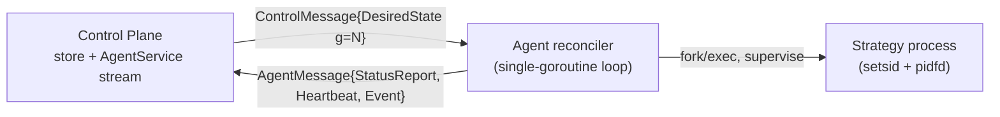

# Strategon

An internal platform for registering trading machines and publishing/supervising
strategy processes, built on **level-triggered desired-state convergence**
(kubelet-inspired): publish, rollback, and disaster recovery are unified into one
mechanism — change the desired state and let the agent converge.

The design is specified in `ARCHITECTURE.md`, `PROTOCOL.md`, `RECONCILER.md`, and
`SAFETY.md`.

## Status: foundation

This repository currently implements the foundational milestones
(`ARCHITECTURE.md §17.1–17.3`): the protocol, the agent reconciler with
exec-driver process supervision, and the control-plane stream endpoint — wired so
"change desired state → agent converges" works end to end.



### Implemented

- **Protocol** (`proto/strategyplatform/v1`): the single source of truth for
  agent, control plane, and (future) frontend. Generated Go + Connect code is
  committed under `gen/`.
- **Agent** (`internal/agent`):
  - `reconciler` — single-goroutine, level-triggered convergence loop with
    digest-based diffing, the full deploy state machine
    (`PENDING→…→HEALTHY|ROLLED_BACK`), O(1) rollback, and known-bad-version skip.
  - `driver` — `exec` driver: `setsid` detachment, cgroup v2 confinement
    (best-effort), `pidfd` exit watch, and `/proc` starttime PID-reuse guard.
  - `supervisor` — `startsecs` classification, exponential crash backoff
    (capped, jittered), graceful stop (drain → SIGTERM → grace → SIGKILL).
  - `artifact` — immutable `releases/<v>` layout with atomic `current` symlink
    switching; local-filesystem fetcher (S3/MinIO deferred).
  - `health` — three-layer scaffolding (Live / Ready / BusinessHealthy).
  - `stream` — outbound gRPC stream client with reconnect + resync.
- **Control plane** (`internal/controlplane`):
  - `store` — spec/status/audit boundary; in-memory impl with monotonic
    per-machine `generation` (Postgres/sqlc deferred).
  - `grpcstream` — `AgentService.Connect` bidi stream: snapshot push on
    connect, on spec change, and on periodic resync.
- **Commands** (`cmd/controlplane`, `cmd/agent`) and an in-process integration
  test proving change-desired → converge → retire.

## Requirements

- Go 1.22+ (Linux for the agent: `pidfd` needs kernel ≥ 5.3).
- [`buf`](https://buf.build) and protoc plugins for regenerating code:
  `make tools`.

## Build, test, generate

```bash
make build      # go build ./...
make test       # go test ./...
make lint       # buf lint
make generate   # regenerate gen/ from proto (after `make tools`)
```

## Run locally

Start the control plane (serves the agent stream over h2c on `:8080`):

```bash
go run ./cmd/controlplane --addr :8080
```

Start an agent (registers as `m1`, releases under a scratch dir):

```bash
go run ./cmd/agent --control-plane http://127.0.0.1:8080 --machine-id m1 --base /tmp/strategon-m1
```

Publish a strategy via the admin stand-in (the full human API is a follow-up).
`digest` must be the `sha256:` of the file referenced by `uri`:

```bash
printf '#!/bin/sh\nexec sleep 300\n' > /tmp/strat.sh && chmod +x /tmp/strat.sh
DIGEST="sha256:$(sha256sum /tmp/strat.sh | cut -d' ' -f1)"
curl -sX POST http://127.0.0.1:8080/admin/assign -d "{
  \"machine_id\":\"m1\",\"strategy\":\"s\",\"version\":\"v1\",
  \"digest\":\"$DIGEST\",\"uri\":\"file:///tmp/strat.sh\"}"
```

The agent downloads, verifies, switches the `current` symlink, starts and
supervises the process, and reports `HEALTHY`. Remove it with
`{"machine_id":"m1","strategy":"s","remove":true}` and the agent retires it.

## Roadmap (deferred follow-ups, with doc references)

- Human API + Svelte UI — `ControlPlaneService` Connect handlers, fleet
  dashboard (`ARCHITECTURE §15`, `PROTOCOL §8`).
- Artifacts/S3 + Postgres store — MinIO/S3 backend, sqlc store, audit
  persistence (`ARCHITECTURE §16.3`).
- Cron local executor (`ARCHITECTURE §10`).
- Fencing lease + safety hardening — lease grant/renew/suicide, pre-order
  inline check, migration interlock, clock/NTP assumptions (`SAFETY.md`,
  `RECONCILER §8`).
- mTLS enrollment + non-root systemd hardening (`ARCHITECTURE §5`, `SAFETY §6`).
- Agent self-update — pidfd re-adoption, systemd guard, canary
  (`ARCHITECTURE §11`, `RECONCILER §10`).
- Disaster-recovery drills (`ARCHITECTURE §13`).
