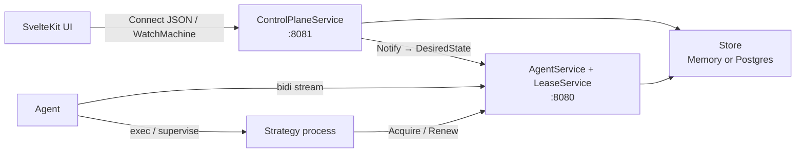
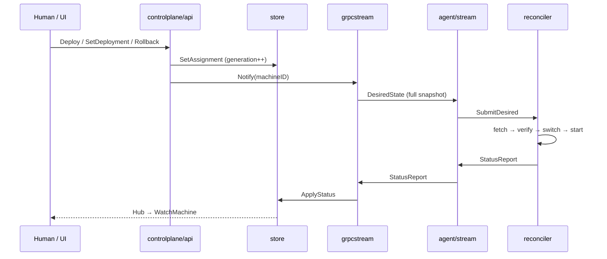

# Architecture

This document is a map of the Strategon repository: what the pieces are, how
they talk, and where to look in the tree. For a runnable walkthrough, see the
root [README](../README.md).

## Idea in one paragraph

Strategon applies a Kubernetes-style control loop to trading strategy
processes. A control plane holds the **desired** assignment per machine. Each
host runs an **agent** that dials in, receives a full desired-state snapshot,
and **reconciles** until reality matches: fetch artifacts, start or replace
processes, report status. Publish, rollback, and recovery are the same
operation — change desired state and wait for convergence.

## Runtime topology

The control plane listens on **two ports** with different clients:

| Port | Flag | Clients | Services |
|------|------|---------|----------|
| `:8080` | `--agent-addr` | Agents, lease SDK | `AgentService`, `LeaseService` |
| `:8081` | `--human-addr` | Browser / CLI | `ControlPlaneService`, `/auth/*`, embedded UI |

Agents are outbound-only: the control plane never dials hosts. Strategy
processes may call `LeaseService` on the agent port directly (via `sdk/lease`);
that path is separate from the agent stream.



## Repository layout

```
cmd/
  controlplane/   Control plane binary (agent port + human port + UI)
  agent/          Per-host reconciler + outbound stream client
  strategon-ca/   Offline Ed25519 CA (init / sign agent certs)
  lease-demo/     Sample process that exercises sdk/lease
internal/
  controlplane/   Human API, agent stream, lease handler, store
  agent/          Reconciler, artifacts, driver, supervisor, stream client
  auth/           Human auth (none | mock | discord) + API tokens
  mtls/           Agent ↔ CP mutual TLS helpers
  webassets/      Embedded SPA (//go:embed of dist/)
  ca/             CA crypto used by strategon-ca
proto/strategyplatform/v1/   API schema (source of truth)
gen/                         Generated Go + Connect code (buf generate)
web/                         SvelteKit SPA (Connect-ES client)
sdk/lease/                   Strategy-side fencing lease client
deploy/                      Production compose + agent install script
```

Generated code under `gen/` and `web/src/lib/gen/` is produced by `make generate`
from `proto/`. Edit protos, not the generated files.

## Control flow



1. **Register** — Agent opens `AgentService.Connect`, sends `Register`. With
   mTLS, client cert CN must match `machine_id`.
2. **Desired state** — On every human write (and on periodic resync), the
   control plane pushes a full per-machine `DesiredState` snapshot over the
   stream.
3. **Reconcile** — A single goroutine in `internal/agent/reconciler` owns
   mutable agent state. It converges each strategy assignment and emits
   `StatusReport` when observed state changes.
4. **Observe** — Human API joins desired + actual into `StrategyView`
   (`converged`, phase, digests, pid). UI watches via `WatchMachine`.

Key packages:

- Write path: `internal/controlplane/api`
- Agent stream: `internal/controlplane/grpcstream`, `internal/agent/stream`
- Reconcile: `internal/agent/reconciler`
- View join: `internal/controlplane/api/view.go`

### File browse & retrieval

Operators can browse a strategy **WorkDir** (`Manager.StrategyDir` =
`<base>/<strategy>`) and download files from the UI. There is no object
storage: bytes flow agent → control plane → browser over the existing
agent-initiated `Connect` bidi stream.

- Human RPCs: `BrowseDir` (unary), `DownloadFiles` (server-stream).
- Southbound: `ListDir` / `FetchFiles` on `ControlMessage`.
- Northbound: `DirListing` / `FileChunk` on `AgentMessage`.
- Control plane correlates with an in-memory broker (`filetransfer.Broker`)
  keyed by `request_id`. Southbound sends go through a per-machine send
  channel owned by the Connect loop (no concurrent `stream.Send`).
- Path safety: agent jails all access with `os.OpenRoot(strategyDir)`.
- Caps: single file ≤ 256 MiB; tarball ≤ 500 files and ≤ 512 MiB uncompressed;
  browse timeout 30s; download timeout 5m; chunk size 64 KiB.
- Capability gate: `agent_version >= 2`. Older agents Nack unknown payloads.
- Audit: a successful download (EOF) appends `action=DownloadFiles` with
  `detail` including paths, filename, transfer kind, and byte count. Failed
  agent validation does not write an audit entry.

## Core concepts

### Three layers: artifact, deployment, machine-shared

| Layer | Scope | What it versions |
|-------|--------|------------------|
| **Artifact** | catalog | Content-addressed binary / config / shared-file blob |
| **Deployment** | machine × strategy | Immutable combination (binary + config + args/env) |
| **MachineShared** | machine | Mutable reference data shared by all strategies |

A **machine** is one agent identity. Its **spec** holds strategy assignments
(`StrategyAssignmentSpec` in `proto/.../spec.proto`): artifact + optional
config, driver, args/env, deploy policy, lease/cron hints.

**Machine-shared files** (`MachineSharedSpec` on `DesiredState.shared`) are
independent of assignment generations. Operators set them via
`SetSharedFiles` (full replace). The agent materializes:

```
<base>/shared/store/<digest>/<name>   # content-addressed
<base>/shared/store/<digest>/<name>.fetched_at  # install time (GC order)
<base>/shared/<name> -> store/...     # atomic symlink switch
<base>/<strategy>/releases/<v>/shared -> ../../../shared
```

Every release gets `releases/<v>/shared` on Download even when no shared
files are desired yet — so a later `SetSharedFiles` works without
re-fetching the binary. A dangling symlink is inert.

Process `WorkDir` is `StrategyDir` = `<base>/<strategy>`, while the shared
tree is reached via `releases/<v>/shared`. So a path like
`./shared/instruments.json` resolves **only** for binaries that resolve
relative paths against the **config file's directory** (not cwd). `seq`
does this (`filepath.Join(filepath.Dir(path), cfg.Catalog.Instruments)`).
A binary resolving relative to cwd would look under
`<base>/<strategy>/shared/…` and miss. **Shared paths in config must be
written relative to the config file, and the consuming binary must resolve
them that way.**

For seq, set:

```yaml
catalog:
  instruments: ./shared/instruments.json
```

`SharedFileRef.artifact_name` selects the catalog artifact; when empty it
defaults to the on-disk `name`. Digests must use the `sha256:` prefix.
Shared files are **single-file only** today: `SetSharedFiles` rejects names
or URIs that look like archives (`.tar.gz`, `.zip`, …). Directory/tarball
extraction is deferred. Identical re-pushes of the same name→digest set are
no-ops (no generation bump, no audit). Shared-file fetch runs off the
reconciler loop (worker goroutine) so a slow URI cannot stall heartbeats or
deploys. Concurrent fetches are capped; GC waits until in-flight work
finishes and orders retention by recorded install time (not mtime).

**Update semantics are next-start:** re-pointing the shared symlink does not
reload running processes; the new content is seen on the next deploy,
restart, or crash-recovery start. The reconciler *initiates* shared
convergence before walking assignments, and **gates** `beginDeploy` /
`startProcess` only while a desired shared file is still **absent**
(`WaitingForShared` — never landed). A stale digest (old live copy while a
new version is fetching or failing) does **not** block starts: keeping the
previous copy is exactly next-start semantics, and blocking on stale would
freeze every strategy on the machine when one bad shared URI fails. Crash-loop
remains a backstop for runtime open failures.

**Status** (`status.proto` / `StatusReport`) is what the agent reports:
`DeployPhase`, running artifacts, conditions, pid, `observed_generation`,
plus `MachineSharedStatus` (per-file running digest / last_error).

### ArtifactRef

Content-addressed binary (and optional config / shared file): `name`,
`version`, `digest`, `uri`, `type`. Humans call `RegisterArtifact`;
`Deploy` / `SetDeployment` / `SetSharedFiles` / `Rollback(target_version)`
resolve a version to a concrete ref and require catalog state **READY**
(ingest finished). Empty-target `Rollback` uses the frozen
`PreviousArtifact` snapshot and skips that guard. The agent fetches the URI
and verifies the digest (`sha256:…` for binaries at verify time).
**`SetSharedFiles` requires a `sha256:` digest** at API ingress (shared store
round-trips that prefix); `RegisterArtifact` does not enforce the prefix so
existing binary/config CI is unchanged. Supported URIs today: `http(s)`,
`file://`, `s3://` (via CP `ResolveArtifactSource`), absolute path. For shared
files the catalog name defaults to the on-disk basename but may differ via
`SharedFileRef.artifact_name`.

### Generation and convergence

- Every mutating assignment write bumps a monotonic **machine generation**.
- `SetSharedFiles` bumps `shared_generation` and also `machines.generation`
  only when the desired name→digest set actually changes; identical re-pushes
  are no-ops. `MachineSharedSpec.generation` is reported independently in status.
- `DesiredState.generation` is the whole southbound snapshot version.
- Per-strategy `observed_generation` advances when that strategy matches
  desired digests and is `HEALTHY`.
- UI `converged` means: phase is `HEALTHY` and desired/running digests match
  (artifact + config). Shared-file converged means running digest equals
  desired digest with no error.

Level-triggered: late or reconnecting agents always get a full snapshot; they
do not replay an event log.

### Deploy phases

Happy path on the agent:

`PENDING → DOWNLOADING → VERIFYING → DRAINING → SWITCHING → STARTING → HEALTH_CHECKING → HEALTHY`

Failure / rollback phases also exist (`FAILED`, `ROLLING_BACK`, …). Imperative
stream RPCs (if any) are latency helpers — desired state remains the source of
truth.

## Storage

| Backend | When | Package |
|---------|------|---------|
| In-memory | `--db` empty (default) | `store.NewMemory` |
| Postgres | `--db=<DSN>` | `store.NewPostgres` + SQL migrations |

Both implement `internal/controlplane/store.Store`. In-memory is fine for local
dev; process restart loses state. Postgres migrations live under
`internal/controlplane/store/migrations/`.

A change hub (`store.Hub`) fans out machine updates to `WatchMachine`
subscribers so the UI can stream without polling.

The control plane handles `SIGINT`/`SIGTERM` with a bounded drain (~10s): stop
accepting on both ports, flush best-effort API-token `last_used` timestamps,
then close the Postgres pool. Deploy platforms should send `SIGTERM` (not
`SIGKILL`) and allow a grace period ≥ that drain timeout.

## Auth and mTLS

**Human API** (`--auth-mode`):

| Mode | Behavior |
|------|----------|
| `none` | No login (local/CI default); audit actor is a mock local user |
| `mock` | Session via `/auth/mock-login` |
| `discord` | Discord OAuth; optional guild gate; flat authz (any login = operator) |

Logged-in operators can mint Bearer API tokens (`str_live_…`) for CLI/SDK use
from the embedded UI **API tokens** page (`/tokens`). OpenAPI for the human
Connect JSON API is generated by `make generate` (`web/static/openapi.json`) and
rendered on a standalone page at `/reference` (outside the app shell).
With `--db` (Postgres), tokens are durable: create/revoke write through to
`api_tokens` (hash only; soft-delete via `revoked_at`), and validation is served
from an in-memory cache loaded at boot. `last_used` is best-effort (batched
flush every ~30s, plus a final flush on graceful shutdown). Without Postgres,
tokens live only in the memory store and are lost on restart — same as other
in-memory state.

**Migrating deploy note:** the first release that introduces `api_tokens` has no
prior durable source, so any in-memory tokens from before that deploy are lost
once. Operators must re-issue tokens after that one migrate.

**Agent port mTLS** (optional, orthogonal to human auth): enable with
`--tls-cert` / `--tls-key` / `--client-ca` on the control plane and matching
client certs on the agent. Issue certs offline with `cmd/strategon-ca`. Online
enrollment (`AgentService.Enroll`) is not implemented yet.

## Frontend

`web/` is a SvelteKit SPA using Connect-ES against `ControlPlaneService`.
Production builds are copied into `internal/webassets/dist` and embedded into
the control plane binary (`make web-build` before `go build` / Docker). Dev
usually runs Vite on `:5173` against a local human API.

Main surfaces: fleet overview, machine detail (`WatchMachine`), deploy,
artifacts, schedules, audit, tokens.

## Build shape

| Target | Purpose |
|--------|---------|
| `make generate` | Regenerate Go + TS from proto |
| `make build` | Compile packages + `bin/controlplane`, `bin/agent` |
| `make web-build` | SPA → `internal/webassets/dist` (required before embed) |
| `make test` | Go tests (incl. Linux integration tests) |
| `Dockerfile` | Multi-stage: SPA → Go embed → scratch control plane image |

CI publishes GHCR images and (on version tags) static agent/control-plane
binaries. Production compose under `deploy/` is an example of how those
artifacts are run; it is not required for local development.

## Where to start reading code

1. `cmd/controlplane/main.go` — how the two ports and store are wired
2. `proto/strategyplatform/v1/*.proto` — API surface
3. `internal/controlplane/api/server.go` — human write path
4. `internal/controlplane/grpcstream/server.go` — agent stream
5. `internal/agent/reconciler/reconciler.go` — converge loop
6. `web/src/lib/api.ts` — UI client and WatchMachine handling
