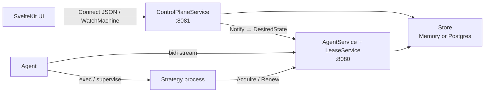
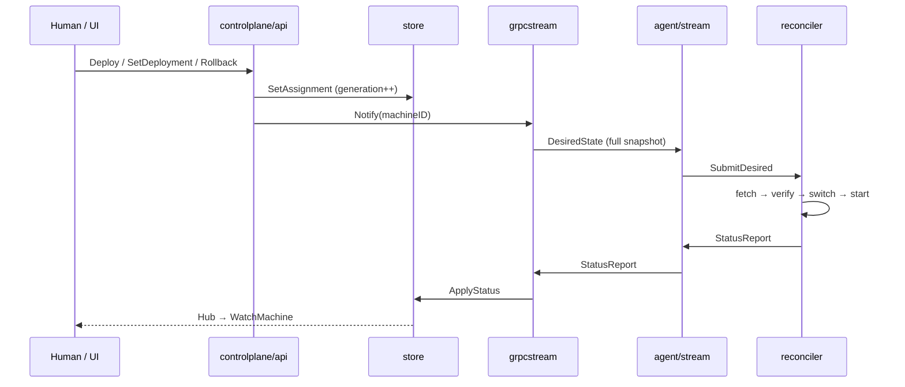

# Architecture

This document is a map of the Strategon repository: what the pieces are, how
they talk, and where to look in the tree. For a runnable walkthrough, see the
root [README](../README.md).

## Idea in one paragraph

Strategon applies a Kubernetes-style control loop to trading strategy
processes. A control plane holds the **desired** assignment per machine. Each
host runs an **agent** that dials in, receives a full desired-state snapshot,
and **reconciles** until reality matches: fetch artifacts, start or replace
processes, report status. Publish, rollback, and recovery are the same
operation — change desired state and wait for convergence.

## Runtime topology

The control plane listens on **two ports** with different clients:

| Port | Flag | Clients | Services |
|------|------|---------|----------|
| `:8080` | `--agent-addr` | Agents, lease SDK | `AgentService`, `LeaseService` |
| `:8081` | `--human-addr` | Browser / CLI | `ControlPlaneService`, `/auth/*`, embedded UI |

Agents are outbound-only: the control plane never dials hosts. Strategy
processes may call `LeaseService` on the agent port directly (via `sdk/lease`);
that path is separate from the agent stream.



## Repository layout

```
cmd/
  controlplane/   Control plane binary (agent port + human port + UI)
  agent/          Per-host reconciler + outbound stream client
  strategon-ca/   Offline Ed25519 CA (init / sign agent certs)
  lease-demo/     Sample process that exercises sdk/lease
internal/
  controlplane/   Human API, agent stream, lease handler, store
  agent/          Reconciler, artifacts, driver, supervisor, stream client
  auth/           Human auth (none | mock | discord) + API tokens
  mtls/           Agent ↔ CP mutual TLS helpers
  webassets/      Embedded SPA (//go:embed of dist/)
  ca/             CA crypto used by strategon-ca
proto/strategyplatform/v1/   API schema (source of truth)
gen/                         Generated Go + Connect code (buf generate)
web/                         SvelteKit SPA (Connect-ES client)
sdk/lease/                   Strategy-side fencing lease client
deploy/                      Production compose + agent install script
```

Generated code under `gen/` and `web/src/lib/gen/` is produced by `make generate`
from `proto/`. Edit protos, not the generated files.

## Control flow



1. **Register** — Agent opens `AgentService.Connect`, sends `Register`. With
   mTLS, client cert CN must match `machine_id`.
2. **Desired state** — On every human write (and on periodic resync), the
   control plane pushes a full per-machine `DesiredState` snapshot over the
   stream.
3. **Reconcile** — A single goroutine in `internal/agent/reconciler` owns
   mutable agent state. It converges each strategy assignment and emits
   `StatusReport` when observed state changes.
4. **Observe** — Human API joins desired + actual into `StrategyView`
   (`converged`, phase, digests, pid). UI watches via `WatchMachine`.

Key packages:

- Write path: `internal/controlplane/api`
- Agent stream: `internal/controlplane/grpcstream`, `internal/agent/stream`
- Reconcile: `internal/agent/reconciler`
- View join: `internal/controlplane/api/view.go`

## Core concepts

### Machine and assignment

A **machine** is one agent identity. Its **spec** holds strategy assignments
(`StrategyAssignmentSpec` in `proto/.../spec.proto`): artifact + optional
config, driver, args/env, deploy policy, lease/cron hints.

**Status** (`status.proto`) is what the agent reports: `DeployPhase`, running
artifacts, conditions, pid, `observed_generation`.

### ArtifactRef

Content-addressed binary (and optional config): `name`, `version`,
`digest` (`sha256:…`), `uri`, `type`. Humans call `RegisterArtifact`; `Deploy`
resolves a version (including `"latest"`) to a concrete ref. The agent fetches
the URI and verifies the digest. Supported URIs today: `http(s)`, `file://`,
absolute path.

### Generation and convergence

- Every mutating assignment write bumps a monotonic **machine generation**.
- `DesiredState.generation` is that snapshot version.
- Per-strategy `observed_generation` advances when that strategy matches
  desired digests and is `HEALTHY`.
- UI `converged` means: phase is `HEALTHY` and desired/running digests match
  (artifact + config).

Level-triggered: late or reconnecting agents always get a full snapshot; they
do not replay an event log.

### Deploy phases

Happy path on the agent:

`PENDING → DOWNLOADING → VERIFYING → DRAINING → SWITCHING → STARTING → HEALTH_CHECKING → HEALTHY`

Failure / rollback phases also exist (`FAILED`, `ROLLING_BACK`, …). Imperative
stream RPCs (if any) are latency helpers — desired state remains the source of
truth.

## Storage

| Backend | When | Package |
|---------|------|---------|
| In-memory | `--db` empty (default) | `store.NewMemory` |
| Postgres | `--db=<DSN>` | `store.NewPostgres` + SQL migrations |

Both implement `internal/controlplane/store.Store`. In-memory is fine for local
dev; process restart loses state. Postgres migrations live under
`internal/controlplane/store/migrations/`.

A change hub (`store.Hub`) fans out machine updates to `WatchMachine`
subscribers so the UI can stream without polling.

## Auth and mTLS

**Human API** (`--auth-mode`):

| Mode | Behavior |
|------|----------|
| `none` | No login (local/CI default); audit actor is a mock local user |
| `mock` | Session via `/auth/mock-login` |
| `discord` | Discord OAuth; optional guild gate; flat authz (any login = operator) |

Logged-in operators can mint Bearer API tokens for CLI use.

**Agent port mTLS** (optional, orthogonal to human auth): enable with
`--tls-cert` / `--tls-key` / `--client-ca` on the control plane and matching
client certs on the agent. Issue certs offline with `cmd/strategon-ca`. Online
enrollment (`AgentService.Enroll`) is not implemented yet.

## Frontend

`web/` is a SvelteKit SPA using Connect-ES against `ControlPlaneService`.
Production builds are copied into `internal/webassets/dist` and embedded into
the control plane binary (`make web-build` before `go build` / Docker). Dev
usually runs Vite on `:5173` against a local human API.

Main surfaces: fleet overview, machine detail (`WatchMachine`), deploy,
artifacts, schedules, audit, tokens.

## Build shape

| Target | Purpose |
|--------|---------|
| `make generate` | Regenerate Go + TS from proto |
| `make build` | Compile packages + `bin/controlplane`, `bin/agent` |
| `make web-build` | SPA → `internal/webassets/dist` (required before embed) |
| `make test` | Go tests (incl. Linux integration tests) |
| `Dockerfile` | Multi-stage: SPA → Go embed → scratch control plane image |

CI publishes GHCR images and (on version tags) static agent/control-plane
binaries. Production compose under `deploy/` is an example of how those
artifacts are run; it is not required for local development.

## Where to start reading code

1. `cmd/controlplane/main.go` — how the two ports and store are wired
2. `proto/strategyplatform/v1/*.proto` — API surface
3. `internal/controlplane/api/server.go` — human write path
4. `internal/controlplane/grpcstream/server.go` — agent stream
5. `internal/agent/reconciler/reconciler.go` — converge loop
6. `web/src/lib/api.ts` — UI client and WatchMachine handling
