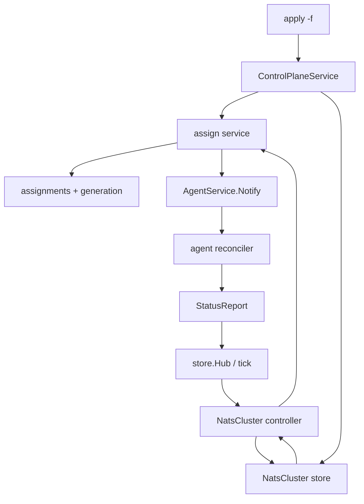

# Epic: Declarative deploy and cluster orchestration

Status: proposed
Depends on: [Architecture](ARCHITECTURE.md)

Strategon already reconciles **per-machine desired assignments**. This epic
adds a Kubernetes-style **human apply surface** and a **control-plane
orchestrator** that writes those assignments over time. The first orchestrated
workload is a NATS cluster: one `nats-server` per machine, routes generated
from membership, rolling updates with `maxUnavailable: 1`.

The agent deploy state machine does not learn about clusters. It keeps
converging a single `StrategyAssignmentSpec`.

---

## Motivation

The control loop is already declarative at runtime:

```
human write → store.SetAssignment → Notify → DesiredState snapshot
           → agent reconciler → StatusReport → WatchMachine / converged
```

The **human API is not**. Operators issue verbs (`Deploy`, `SetDeployment`,
`Stop`, `Start`, `SetSchedule`, `SetSharedFiles`). There is no YAML object,
no `apply`, no server-side document that means “this is the whole intent.”
Fleet sequencing (canary one machine, wait healthy, continue; migrate only
after a fencing lease drops) lives in the operator’s head or in a shell
script.

That gap matters as soon as a workload is **more than one process**:

- A NATS cluster is not “deploy `nats` to m1.” It is membership, per-node
  identity, route lists, and “only one server may be down at a time.”
- The same shape appears later for lease-safe strategy migration and
  canary fleets.

Kubernetes solves this by splitting **objects** (what you apply) from
**node execution** (kubelet). Strategon should do the same: apply and
orchestrate on the control plane; keep the agent a level-triggered
executor.

Without this epic, every new “scheme” tempts us to special-case
`internal/agent/reconciler/deploy.go`. That breaks reconnect semantics
(agents only see the latest snapshot, not a workflow cursor) and couples
trading-process supervision to infrastructure topology.

---

## Goals

1. A typed apply document (`kind` + `metadata` + `spec`) can create or
   update a single strategy assignment without verb RPCs.
2. Identical re-apply is a no-op (no generation bump, no agent churn).
3. A `NatsCluster` object is stored independently of assignments. A CP
   controller is the only writer of the `nats` (or configured) assignments
   it owns.
4. Creating or upgrading a cluster rolls **at most `maxUnavailable`
   machines at a time**, advancing only when the in-flight nodes are
   Ready.
5. Per-node NATS identity comes from **assignment `env`** and routes from
   **assignment `args`** — one shared config artifact, not a catalog
   config version per machine.
6. Agent readiness can wait on a real HTTP `/healthz` (NATS monitor port),
   and an unready node **stays** unready: the health window must gate the
   rollout rather than promote on timeout.
7. A CLI `apply` / `wait` exists so GitOps is “submit the object,” not
   “loop Deploy from a laptop.”

## Non-goals

- Generic workflow / DAG engine (no user-defined steps, sleeps, or scripts
  in the agent).
- Kubernetes SSA / field managers (single writer per object for now).
- Scheduler, replicas, or running three NATS servers on one machine under
  one strategy name.
- Using fencing leases to serialize NATS (leases mean “only one trader”).
- Teaching the agent cluster membership, JetStream meta, or route gossip.
- Changing the single-slot Recreate pipeline (`download → verify → drain
  → switch → start`) except for an optional readiness probe and the
  health-window deadline that probe implies. Specs without a probe keep
  today's phase behaviour unchanged.
- UI for cluster rollouts (ticket later; observe via `WatchMachine`).
- Drain/flatten hooks for trading processes (orthogonal).

---

## Current state (what we reuse)

| Piece | Today |
|-------|--------|
| Desired snapshot | `DesiredState.assignments` is a full list; reconnect = latest |
| Write path | `Deploy` / `SetDeployment` go through `commitAssignment`; **`Stop`/`Start` (`setRunState`), `Undeploy`, `SetSchedule`, `Rollback` each open-code `SetAssignment` + `AppendAudit` + `Notify`** |
| Persistence | `assignments.spec` BYTEA; `SetAssignment` **always** increments `machines.generation` |
| No-op precedent | `Store.SetSharedFiles` already returns `changed` and skips the bump + notify when the desired set is unchanged — copy that contract |
| New assignment | Lands `stopped=true` (create-then-start), `server.go:243` |
| Config catalog | `{artifact}-config`, falling back to `{strategy}-config` (`resolveArtifact`) → **same bytes on every machine** |
| Per-machine knobs | `args` / `env` on `StrategyAssignmentSpec` |
| Placeholders | `${CONFIG}` / `${BINARY}` / `${RELEASE_DIR}` expand in **`args` only**; `env` values are passed verbatim (`renderArgs`, `placeholderValues`) |
| Deploy policy | Proto fields exist; human API almost never sets them; defaults `health_window_seconds: 30`, `enable_auto_rollback: true` (`server.go:889`) |
| Ready | `health.UnixSocketChecker` exists; production agent uses `AlwaysReady` **and never sets `Deps.ReadyEndpoint`**, so the endpoint is always `""` — even `UnixSocketChecker` would return `NoEndpoint → TRUE`. Readiness is unconditionally true today, whichever checker is installed. |
| Health window | On deadline with `enable_auto_rollback: false`, the agent calls **`markHealthy`** — the window is a grace period, not a gate (`reconciler.go:707`) |
| Lease interlocking | `DeploymentBlockedByLease(store, machine, strategy)` reads the CP **lease store keyed by strategy name**. `StrategyAssignmentSpec.lease` is not consulted. It blocks when *another* machine holds an unexpired lease (+`LeaseMarginCP`); a machine holding no lease is never blocked. |
| Convergence | `isConverged` / `buildStrategyView` are **unexported** in `internal/controlplane/api/view.go` |
| Hub | `Hub.Subscribe(machineID)` only — there is no fleet-wide subscription |
| Object meta | `ObjectMeta` already on `Machine` (`name`, `uid`, `generation`, `labels`) |
| Migrations | `internal/controlplane/store/migrations/` is at `0008`; the cluster table is `0009` |
| CLI | None; curl + UI |

The southbound path (Notify → agent → phase machine) stays the success
path. New code only decides **which assignment to write, when**.

### Three facts that change the design

Reading the code closed three assumptions this epic originally made:

1. **`converged` does not imply ready.** With `enable_auto_rollback: false`
   the agent promotes to `HEALTHY` when the health window expires,
   regardless of the probe. `isConverged` then returns true. A NATS node
   that never answers `/healthz` would be reported converged and the roll
   would continue to the next node — the exact whole-cluster outage E5
   exists to prevent. See [Readiness that actually gates](#readiness-that-actually-gates).
2. **Omitting `LeaseSpec` does not disable lease interlocking.** The check
   is keyed by strategy name in the lease store, not by the assignment's
   `lease` field. NATS is safe today only because nothing acquires a lease
   named `nats`. See [Who checks the lease](#who-checks-the-lease).
3. **Readiness is not wired at all.** `Deps.ReadyEndpoint` is an agent-side
   func keyed by strategy that `cmd/agent` never sets, so E5 is
   "plumb spec → state → probe", not "add a field and swap the checker".

---

## Design

### Four-field object

Every apply document is:

```yaml
apiVersion: strategyplatform.v1   # schema generation (proto package)
kind: StrategyAssignment          # which store + RPC + controller
metadata:
  name: hello                     # human identity; apply same name = update
  labels: {}                      # index only; must not bump generation
spec:                             # desired; every change bumps generation
  ...
# status is server-written; clients must not forge generation / uid
```

| Field | Job |
|-------|-----|
| `kind` | Dispatch. `StrategyAssignment` → assign API; `NatsCluster` → cluster store. Never sent to the agent. |
| `metadata.name` | Stable key. Cluster `trading` is `nats_clusters.name`. |
| `metadata.uid` | Server-issued, immutable; later GC / audit. |
| `metadata.generation` | +1 on **spec** change only. Labels do not increment it. |
| `spec` | Intent. Controller compares computed assignments to live ones. |
| `status` | Observed summary (`observedGeneration`, phase, per-server ready). |

`Machine.spec` in `GetMachine` remains enrollment hardware (`MachineSpec`
in `enrollment.proto`). It is **not** desired workload.

### Two control loops



1. **Agent loop (exists):** one machine, one strategy, Recreate +
   `DeployPolicy`. Level-triggered on `DesiredState`.
2. **Cluster loop (new):** one `NatsCluster` spec + fleet `StrategyView`.
   Writes assignments through the same assign service. Level-triggered:
   CP restart reloads clusters and recomputes; no workflow cursor.

`ApplyNatsCluster` **only persists the cluster object**. If it also
`SetAssignment` on all members, rolling update is skipped and the
orchestrator is a batch Deploy.

### Apply assignment semantics

New RPC `ApplyAssignment` (name bikeshed-able) writes a **full**
`StrategyAssignmentSpec` after catalog resolution:

- Client sends versions, args, env, `stopped`, `deploy_policy`,
  schedules, limits — **not** digest/uri.
- Resolve via existing `resolveArtifact` / `requireArtifactReady`.
- Compare with `proto.Equal` on the stored spec; equal → return current
  generation, no notify.
- Honour `stopped` from the document (NATS must start, so `stopped:
  false`). Do not force create-then-start when the document says run.
- Default **no prune** of other strategies on the machine.
- `Deploy` / `SetDeployment` keep today’s merge behaviour; they become
  wrappers around the assign service.

### Where the no-op lives: the store, not the service

`SetSharedFiles` already solves this problem one layer down — it returns
`changed` and skips both the generation bump and the notify when the
desired set is identical. Do the same rather than inventing a second
pattern in the service:

```go
// was: SetAssignment(machineID, strategy string, spec *pb.StrategyAssignmentSpec) (int64, error)
SetAssignment(machineID, strategy string, spec *pb.StrategyAssignmentSpec) (gen int64, changed bool, err error)
```

Why the store and not the assign service:

- It catches **every** writer, including the four that bypass
  `commitAssignment` today and any future one.
- `PreviousArtifacts` rollback bookkeeping lives inside `SetAssignment`
  (`memory.go:154`). A service-layer short-circuit has to reason about
  when *not* to disturb it; a store-layer one simply returns before
  touching anything.
- The Postgres and memory implementations already share the shape from
  `SetSharedFiles`, so the diff is mechanical.

The assign service then owns the consequence: `changed == false` → no
audit entry, no `agents.Notify`, return the current generation.

### Who checks the lease

`DeploymentBlockedByLease` is keyed by **strategy name in the lease
store**; the assignment's `lease` field is never read. So "generate no
`LeaseSpec`" does not exempt the NATS controller — if the check lives
inside the assign service, the controller inherits it and any lease
acquired under the cluster's strategy name silently wedges a rollout.

Interlocking is a property of the **caller's intent** ("a human is moving
a trader between machines"), not of the write path. The assign request
carries it explicitly:

```go
type Request struct {
    MachineID, Strategy string
    Spec                *pb.StrategyAssignmentSpec
    Action              string // audit verb
    // EnforceLeaseInterlock rejects the write when another machine holds an
    // unexpired lease for Strategy. Human verbs set it; controllers that own
    // a strategy name outright do not.
    EnforceLeaseInterlock bool
}
```

`Deploy` / `SetDeployment` / `Rollback` pass `true` (today's behaviour,
unchanged). The NatsCluster controller passes `false`, because E3 makes it
the sole owner of that strategy name — see the reservation rule below.

### Convergence must be shared, not re-derived

`isConverged` and `buildStrategyView` are unexported in
`internal/controlplane/api`. A controller under
`internal/controlplane/orchestrator` needs the same desired/actual join,
and a second copy of "digests and versions match" will drift from the
agent's own equality check.

Move the join to `internal/controlplane/view` (package `view`) and leave
thin wrappers in `api`. One definition of converged, used by the UI, the
CLI and the controller.

### Hub needs a fleet-wide subscription

`Hub.Subscribe(machineID)` is per-machine. A controller watching N members
would otherwise have to open and close subscriptions as membership
changes. Add:

```go
// SubscribeAll signals every machine change, delivering the machine ID.
func (h *Hub) SubscribeAll() (<-chan string, func())
```

Buffered and coalescing like `Subscribe`. The controller filters by
membership itself, so cluster edits do not churn subscriptions.

### NATS as the first `kind`, not a special agent path

One cluster → one strategy name (default `nats`). One process slot per
machine. Shared `nats.conf` in the catalog uses `$ENV` substitution:

```conf
server_name: $NATS_SERVER_NAME
port: $NATS_CLIENT_PORT
http_port: $NATS_MONITOR_PORT
cluster {
  name: $NATS_CLUSTER_NAME
  port: $NATS_CLUSTER_PORT
}
```

**Routes go in `args`, not in the config.** `nats-server`'s `$VAR`
substitution replaces a single token, so `routes: [ $NATS_ROUTES ]` with
`NATS_ROUTES="nats://a:6222,nats://b:6222"` yields one array element
containing a comma — not two route URLs — and the server rejects it.
The `--routes` flag *does* accept a comma-separated list. Since `args`
is already per-machine on `StrategyAssignmentSpec`, that keeps one shared
`nats.conf` for the whole cluster with no extra machinery.

Generated per-server spec:

```yaml
args: ["-c", "${CONFIG}", "--routes", "nats://m2:6222,nats://m3:6222"]
env:
  NATS_SERVER_NAME:  nats-m1
  NATS_CLUSTER_NAME: trading
  NATS_CLIENT_PORT:  "4222"
  NATS_CLUSTER_PORT: "6222"
  NATS_MONITOR_PORT: "8222"
```

`${CONFIG}` is mandatory and easy to miss: the agent materialises the
config artifact on disk and expands `${CONFIG}` **only inside `args`**
(`renderArgs` / `placeholderValues`). Env values are passed through
verbatim — there is no expansion there — so nothing but an explicit
`-c ${CONFIG}` gets the config file to `nats-server`.

The route list is the other members' `nats://<routeHost>:<clusterPort>`,
never self. `routeHost` is required on each server entry — do not guess
`Register.hostname`.

Generated `DeployPolicy` for NATS:

- `enable_auto_rollback: true` — the epic previously said `false`, which
  was wrong on both counts. On **bootstrap** there is no previous version,
  so `beginRollback` reports `FAILED` with `RollbackImpossible`: an honest
  terminal signal the controller can stop on. On **upgrade** the node
  returns on the previous nats-server version instead of staying dead,
  which is what you want for a quorum member; the controller sees
  `ROLLED_BACK` ≠ converged and stops the roll either way. Setting `false`
  buys nothing and, before the health-window fix below, actively lies.
- `health_window_seconds` long enough for listen + route join. With a
  readiness probe set this is a **deadline**, not a grace period.
- No `LeaseSpec` — but note this does *not* disable interlocking; see
  [Who checks the lease](#who-checks-the-lease).

Rollout rule (same code for bootstrap and upgrade):

| Observation | Action |
|-------------|--------|
| Assignment missing or spec ≠ computed | Candidate to write |
| In-flight count already `maxUnavailable` | Write nothing more |
| In-flight node `FAILED` / `ROLLED_BACK`, or controller ready deadline passed | `status.phase=Failed` / `Degraded`; stop expanding |
| In-flight node converged **and** `Ready` condition `TRUE` | Drop from in-flight; take next candidate |
| All members match, converged and Ready | `Ready`, `observedGeneration = spec.generation` |
| Cluster deleting | Undeploy one-by-one, then delete the row |

The gate is `converged && Ready`, never `converged` alone — the agent can
reach `HEALTHY` on a timeout (see below), and the controller must not
depend on that having been fixed. The `Ready` condition is already carried
on `StrategyView.conditions`, so no new plumbing is needed for it.

Do not `sleep` in the reconcile body. `waitReadySeconds` is a deadline
checked on Hub notifications and a tick, held by the **controller** —
independent of the agent's own health window.

JetStream “cluster has a meta leader” is **controller-side** (optional
later scrape of a monitor URL). Agents only report local process Ready.

### Readiness that actually gates

This is the one place the agent changes, and it is two changes, not one.

**(a) Give the probe an endpoint.** Production `cmd/agent` installs
`health.AlwaysReady{}`, but that is only half the reason readiness is
meaningless today. `Deps.ReadyEndpoint` — an agent-side func keyed by
strategy — is never set, so `probeReadiness` always passes `endpoint ==
""`, and `UnixSocketChecker` short-circuits that to `NoEndpoint → TRUE`.
Swapping the checker in `main.go` alone would change nothing.

Add an optional readiness probe to `StrategyAssignmentSpec` (HTTP URL;
unix socket path stays valid) and read it from the desired spec at probe
time. `probeReadiness` already has `r.desired[st.strategy]` in hand, so
this is a small change — but it is spec → state → probe plumbing, and the
existing `Deps.ReadyEndpoint` becomes the fallback for an unset field.

**(b) Stop promoting on timeout when a probe is configured.** Today:

```go
if now.After(st.healthDeadline) {
    if ...GetEnableAutoRollback() && st.inflight != nil {
        r.beginRollback(spec, st)
    } else {
        r.markHealthy(st)   // <-- window expired, never probed, now HEALTHY
    }
```

So the health window is a grace period: a process that never answers
`/healthz` is promoted, `isConverged` returns true, and a rolling
controller advances to the next node. (a) on its own does not fix this —
it just makes the probe return `FALSE` while the phase says `HEALTHY`.

The rule: **a spec that declares a readiness probe turns the health window
into a deadline.** Window expires without `Ready == TRUE` → rollback if
enabled, else `FAILED` — never `markHealthy`. A spec with no probe keeps
today's behaviour byte for byte, so every existing trader is unaffected
and no migration is needed.

Presence of the probe is the switch; no new `require_ready` policy field.
A spec that declares a readiness endpoint has already said readiness is
meaningful for it, and a second flag could only ever be set to disagree
with the first.

No `if strategy == "nats"` in the reconciler.

### Follow-on schemes (out of this epic’s tickets)

Once apply + a rolling writer exist, `LeaseMigrate` and `CanaryMachines`
are additional CP objects or `scheme.type` values that also only call
the assign service. They are listed so reviewers see the intended
extension point; they are not in the ticket cut.

---

## Ticket split

```text
E0 contract note (this epic is the contract)
     │
     ▼
E1 assign service + store-level no-op + shared view/Hub seams
     │
     ├─────────────────────────┐
     ▼                         ▼
E3 NatsCluster store      E2 ApplyAssignment RPC
     │                         │
     ▼                         │
E4 NatsCluster controller      │
     │                         │
     ▼                         │
E5 Ready probe + honest        │
   health window (agent)       │
     │                         │
     └────────────┬────────────┘
                  ▼
        E6 examples + CLI apply/wait
                  │
                  ▼
        E7 UI (optional)
```

Two changes from the original linear cut:

- **E2 is parallel, not a prerequisite.** The controller writes through
  the E1 assign service directly and never calls `ApplyAssignment`. Only
  E6's `kind: StrategyAssignment` dispatch needs E2. The original graph
  forced a wait that does not exist.
- **E5 is now a dependency of correctness, not just of production
  readiness.** E4 can be developed and unit-tested against fake agents
  before E5 lands, because the controller gates on `converged && Ready`
  with its own deadline. But until E5's health-window fix ships, a real
  agent reports `HEALTHY` on timeout and a real cluster roll can walk
  through a broken node. **Do not point E4 at real agents until E5 is
  merged.**

---

### E1 — Extract assign service; no-op identical specs

**Description**

Assignment writes are spread across `internal/controlplane/api/server.go`
(`buildDeploymentSpec`, `commitAssignment`, artifact READY, lease check,
audit, `Notify`). `store.SetAssignment` increments generation on every
call, so a future controller that re-applies the same spec would churn
agents forever.

Only `Deploy` and `SetDeployment` go through `commitAssignment` today.
`setRunState` (Stop/Start, `server.go:393`), `Undeploy` (`:431`),
`SetSchedule` (`:466`) and `Rollback` (`:307`) each open-code
`store.SetAssignment` + `AppendAudit` + `agents.Notify`. The refactor
surface is five call sites, not two.

Extract an internal assign API used by all of them, and push the
identical-spec no-op down into the store so no future caller can miss it.
This ticket also lands the two small seams E4 needs, so E4 is pure
controller logic.

**Goals**

- One package (e.g. `internal/controlplane/assign`) owns resolve + write
  + audit + notify. All five verb paths call it; HTTP JSON behaviour
  unchanged for clients.
- `Store.SetAssignment` returns `(gen int64, changed bool, err error)`,
  mirroring `SetSharedFiles`: identical spec → no generation bump, no
  hub notify, `changed=false`. Memory and Postgres both.
- Assign service skips the audit entry and `agents.Notify` when
  `changed == false`.
- Lease interlocking becomes an explicit `EnforceLeaseInterlock` field on
  the assign request rather than an unconditional step inside spec
  building. Every existing verb passes `true`.
- Move `buildStrategyView` / `isConverged` / `assignmentLive` to
  `internal/controlplane/view`; `api` keeps thin wrappers.
- Add `Hub.SubscribeAll() (<-chan string, func())`, buffered and
  coalescing like `Subscribe`.

**Acceptance**

- [ ] Existing `internal/controlplane/api` and integration tests pass
      without client-visible proto changes.
- [ ] Unit test: write spec A, write equal A again → same generation,
      `Notify` count does not increase, no second audit entry.
- [ ] Unit test: any env/version/stopped change → generation +1 and
      Notify.
- [ ] Unit test: the equal-spec no-op holds for **every** verb path,
      including `SetSchedule` and `Stop` on an already-stopped strategy.
- [ ] Unit test: `PreviousArtifacts` is unchanged by a no-op write, so a
      subsequent `Rollback` still targets the correct prior version.
- [ ] Lease interlocking unchanged for human verbs: a deploy is rejected
      when **another** machine holds an unexpired lease (+`LeaseMarginCP`)
      for that strategy; a machine holding no lease is not blocked.
- [ ] Unit test: `EnforceLeaseInterlock=false` writes through a lease held
      by another machine (the controller path).
- [ ] `Hub.SubscribeAll` delivers machine IDs and drops rather than blocks
      when the subscriber is slow.

---

### E2 — `ApplyAssignment` (declarative single assignment)

**Description**

Add a human RPC that takes a full desired assignment (versions + runtime
+ policy + schedules) and upserts it. This is the generic apply target
for `kind: StrategyAssignment`. Catalog resolution stays as today
(`latest` pins to a concrete version; digest/uri are not client-supplied).

Unlike `SetDeployment`, Apply is **not** a partial merge: omitted
schedules mean empty schedules. Document that in proto comments.

Not a prerequisite for E3/E4 — the controller calls the assign service
directly. This ticket exists for `kind: StrategyAssignment` in E6 and can
run in parallel with the cluster work.

**Goals**

- `ControlPlaneService.ApplyAssignment` in
  `proto/strategyplatform/v1/control_service.proto`.
- `stopped` comes from the request; a document can start a process on
  first apply (`stopped: false`).
- `DeployPolicy` is writable (NATS will need `enable_auto_rollback:
  false`).
- `make generate` updates Go and TS clients.
- Optional: read-back helper so `GetMachine` / a small `GetAssignment`
  can round-trip enough fields for `get -o yaml` in E6.

**Acceptance**

- [ ] `buf generate` / `make generate` clean.
- [ ] API tests: missing machine / unknown version / not-READY artifact
      → the same error classes as `Deploy`.
- [ ] API test: first apply with `stopped=false` results in desired
      running (not halted).
- [ ] API test: apply policy + env + schedules in one call; `GetMachine`
      `StrategyView` / spec shows them.
- [ ] Re-apply identical body → no generation bump (E1).
- [ ] Other strategies on the same machine are left untouched (no prune).
- [ ] API test: `Deploy` on a brand-new strategy still lands
      `stopped=true` (create-then-start preserved); only Apply honours a
      document-supplied `stopped: false` on first write.

---

### E3 — `NatsCluster` resource (persist only)

**Description**

Introduce `kind: NatsCluster` as its own stored object. Human Apply
validates and writes spec; **it must not write assignments**. Status
starts as `Pending` / `observedGeneration=0`.

Suggested spec fields: `artifactVersion`, `configVersion`, `strategy`
(default `nats`), `servers[]` (`machine`, `serverName`, `routeHost`,
ports), `update.maxUnavailable`, `update.waitReadySeconds`.

**Goals**

- Proto module (e.g. `proto/strategyplatform/v1/nats.proto`) + RPCs:
  `ApplyNatsCluster`, `GetNatsCluster`, `ListNatsClusters`,
  `DeleteNatsCluster` (delete may be “mark deleting”; actual Undeploy
  is E4).
- Store: Postgres migration (`0009_nats_clusters.sql`) + memory
  implementation. BYTEA spec/status matches existing assignment style.
- Validation: registered machines, unique `serverName`, non-empty
  `routeHost`, artifact/config READY (using the same
  `{artifact}-config` → `{strategy}-config` fallback as
  `resolveArtifact`), `maxUnavailable >= 1`.
- **Strategy-name reservation.** Apply is rejected if any member machine
  already carries an assignment for the cluster's strategy name that this
  cluster does not own. Without it, a human `Deploy nats` is silently
  adopted on create and destroyed on delete — and note that
  `SetAssignment(nil)` also drops `rec.Status[strategy]`, so the evidence
  goes with it. This is the cheap version of `ownerReferences`; do it now
  rather than deferring, because the failure is data loss.
- Symmetrically: once a cluster exists, human verbs on that
  machine+strategy return `FailedPrecondition` pointing at the cluster.
- Spec change increments cluster `metadata.generation`; label-only
  change does not.
- Kick/watch hook so E4 can wake on spec write (channel or Hub).

**Acceptance**

- [ ] Apply valid YAML-equivalent JSON → row exists; all member machines
      still have **no** `nats` assignment.
- [ ] Apply invalid `routeHost` / unknown machine / not-READY artifact
      → `InvalidArgument` / `FailedPrecondition`; no row (or no
      generation bump).
- [ ] Apply naming a machine that already has an unowned `nats`
      assignment → `FailedPrecondition`, no row written.
- [ ] `Deploy` / `SetDeployment` of `nats` to a machine owned by a
      cluster → `FailedPrecondition`, assignment untouched.
- [ ] Get/List return server-filled `uid`, `generation`, `created_at`.
- [ ] Memory + Postgres store tests for upsert, get, list, generation
      rules.
- [ ] `make generate` and existing tests still pass.

---

### E4 — `NatsCluster` controller

**Description**

A control-plane goroutine reconciles each cluster: compute per-machine
assignment (artifact, shared config, env, probe later, deploy policy),
diff, write at most `maxUnavailable` updates via the E1 assign service,
update `NatsCluster.status`.

Subscribe via `Hub.SubscribeAll` (E1) and a short tick. On CP process
start, list all clusters and reconcile (level-triggered).

**Goals**

- Package e.g. `internal/controlplane/orchestrator` wired from
  `cmd/controlplane/main.go`.
- Spec generation, per member:
  - `env`: `NATS_SERVER_NAME`, `NATS_CLUSTER_NAME`, `NATS_CLIENT_PORT`,
    `NATS_CLUSTER_PORT`, `NATS_MONITOR_PORT`.
  - `args`: `["-c", "${CONFIG}", "--routes", "<others, comma-joined>"]`.
    Routes are **not** an env var — `$VAR` inside a config array does not
    expand to a list, and `${CONFIG}` expands only in `args`.
  - `deploy_policy`: `enable_auto_rollback: true`, health window sized
    for listen + route join.
- Readiness gate is `converged && Ready condition == TRUE`, read from
  `view.BuildStrategyView` (E1). Never `converged` alone.
- The controller holds its own `waitReadySeconds` deadline per in-flight
  node, independent of the agent's health window.
- Assign requests set `EnforceLeaseInterlock: false` (E3 makes the
  controller the sole owner of the strategy name).
- Bootstrap and version bump share one rolling loop.
- Status phases: `Pending`, `Rolling`, `Ready`, `Degraded`, `Failed`,
  and a deleting path that Undeploys members then removes the object.
- Audit entries when the controller writes an assignment (`detail`
  includes cluster name + generation).
- No lease field on generated specs.

**Acceptance**

- [ ] Unit: 3 servers, apply cluster → only first candidate written.
- [ ] Unit: mark that machine assignment converged + Ready → second
      write happens, not the third in the same pass if
      `maxUnavailable=1`.
- [ ] Unit: in-flight node converged but `Ready` condition `FALSE` → the
      next member is **not** written. This is the regression test for the
      `markHealthy`-on-timeout hole; it must pass even before E5.
- [ ] Unit: controller `waitReadySeconds` elapses with the node still not
      Ready → `Degraded` with a reason, no further writes.
- [ ] Unit: in-flight node `ROLLED_BACK` (upgrade failed, previous
      version restored) → treated as failure, roll stops.
- [ ] Unit: bump `artifactVersion` → rolling one node at a time; already
      matching nodes not rewritten (E1 no-op).
- [ ] Unit: in-flight `FAILED` → no further members updated; status
      `Failed` or `Degraded` with a reason.
- [ ] Unit: controller restart with 2/3 already correct → only the
      remaining member is written.
- [ ] Unit: generated `args` carry `-c ${CONFIG}` and a comma-joined
      `--routes` excluding self; no `NATS_ROUTES` env var is emitted.
- [ ] Unit: a member whose status has been pruned (assignment deleted,
      `rec.Status` gone) is treated as absent, not as still-deploying.
- [ ] Integration-style test with fake agents (existing
      `internal/integration` pattern): assignments, args and env appear in
      `DesiredState` in roll order.
- [ ] Reconcile does not busy-loop `SetAssignment` on Ready clusters.

---

### E5 — Ready probe on the agent, and an honest health window

**Description**

Two defects, one ticket — either alone leaves the gate open.

1. **Readiness is never probed.** `cmd/agent` installs
   `health.AlwaysReady{}`, *and* `Deps.ReadyEndpoint` is never set, so
   `probeReadiness` passes `endpoint == ""` and even
   `UnixSocketChecker` returns `NoEndpoint → TRUE`. Both halves must be
   fixed; swapping the checker alone changes nothing.
2. **The health window promotes on timeout.** With
   `enable_auto_rollback: false` and no inflight rollback,
   `reconciler.go:707` calls `markHealthy` when the deadline passes. A
   process that never became ready is reported `HEALTHY`,
   `isConverged` agrees, and a rolling controller walks on.

**Goals**

- Proto: optional readiness probe on `StrategyAssignmentSpec` (HTTP URL;
  a unix socket path stays valid). Regenerate Go + TS.
- `probeReadiness` resolves the endpoint from `r.desired[st.strategy]`
  first, falling back to `Deps.ReadyEndpoint` when the field is unset.
- `cmd/agent` installs a checker handling both schemes instead of
  hard-coding `AlwaysReady`.
- **Health window becomes a deadline when a probe is configured.** On
  expiry without `Ready == TRUE`: rollback if enabled, else `FAILED`.
  Never `markHealthy`. A spec with no probe keeps today's behaviour
  exactly — that back-compat is what makes this safe to land under
  running traders.
- No new policy flag: probe presence is the switch.
- E4 fills `http://127.0.0.1:<monitorPort>/healthz`.

**Acceptance**

- [ ] Reconciler test: probe configured, not yet listening → stays
      `HEALTH_CHECKING`, Ready false.
- [ ] Reconciler test: probe configured, still failing when the health
      window expires, `enable_auto_rollback: false` → `FAILED`, **not**
      `HEALTHY`. This is the core regression test for the epic.
- [ ] Reconciler test: same with `enable_auto_rollback: true` and a
      previous version → `ROLLED_BACK`; with no previous version →
      `FAILED` / `RollbackImpossible`.
- [ ] Reconciler test: probe 200 → `HEALTHY` and Ready true.
- [ ] Reconciler test: **no** probe configured, window expires,
      `enable_auto_rollback: false` → still `HEALTHY` (unchanged
      behaviour for every existing strategy).
- [ ] Existing strategy tests with empty probe still converge, untouched.
- [ ] Controller unit (or integration): NATS assignment carries the
      monitor URL; fake agent Ready false blocks the next machine.
- [ ] Manual or scripted check documented in E6: nats-server down on
      8222 is not Ready, and the cluster roll halts rather than
      continuing.

---

### E6 — Example artifacts and CLI

**Description**

Make the path runnable without composing curl by hand. CLI talks to
`:8081` with an existing API token (`str_live_…`). Apply dispatches on
`kind`. Wait watches cluster status (or `WatchMachine` on members).

**Goals**

- `examples/nats/` (or `deploy/nats/`): cluster YAML, `nats.conf`
  template, how to `RegisterArtifact` the server binary/image + config.
- CLI commands: `apply -f`, `get natscluster <name>`, `wait
  natscluster <name> --for=ready --timeout=…`.
- Apply of `kind: StrategyAssignment` uses E2 (proves dispatch).
- README or example doc: three agents, apply cluster, confirm routes
  (`/routez` or equivalent). State that E5 is required for safe
  production rolls.

**Acceptance**

- [ ] `apply -f` on the example `NatsCluster` hits `ApplyNatsCluster`,
      not a client-side loop of `Deploy`.
- [ ] `apply` of an unchanged file exits 0 and does not bump cluster
      generation.
- [ ] `wait --for=ready` succeeds after the controller reaches
      `Ready` in a test double or local three-agent setup.
- [ ] Unknown `kind` → non-zero exit and a clear error.
- [ ] Example doc lists required artifact names/versions and
      `routeHost` as a real address.
- [ ] Example `nats.conf` contains **no** `routes:` block, and the doc
      explains that routes ride on `--routes` in `args` because `$VAR`
      does not expand into a config array.
- [ ] Example config artifact is registered under `nats-config` (or
      `{artifact}-config`), matching `resolveArtifact`'s lookup.

---

### E7 — Cluster UI (optional, last)

**Description**

Read-only (or apply-via-form) view of `NatsCluster` list and per-server
phase, reusing `WatchMachine` / GetNatsCluster. Must not become a second
write path that bypasses the controller (no “deploy nats to all”
button).

**Goals**

- Fleet or dedicated page: cluster name, `status.phase`,
  `observedGeneration` vs generation, per-machine assignment phase.
- Writes, if any, only `ApplyNatsCluster` / delete.

**Acceptance**

- [ ] Page shows a Ready cluster and a Rolling cluster fixture.
- [ ] No UI control that `SetDeployment`s all members in one click.
- [ ] Browser check of the new route and the existing machine detail
      page (assignment still visible as `nats`).

---

## Suggested issue titles

Copy-paste for the tracker:

1. `E1: Extract assign service; skip generation bump on identical spec`
2. `E2: Add ApplyAssignment RPC for full desired spec`
3. `E3: Persist NatsCluster objects and reserve their strategy name`
4. `E4: Reconcile NatsCluster into rolling per-machine assignments`
5. `E5: Ready probe and honest health window so a rollout can wait on /healthz`
6. `E6: NATS example manifests and strategon apply/wait CLI`
7. `E7: Read-only NatsCluster UI`

Each issue should link this epic and paste the **Acceptance** checklist
from the matching section.

---

## Risks

| Risk | Mitigation |
|------|------------|
| **Health window promotes an unready node to `HEALTHY`, so a roll walks through a broken server and takes the cluster below quorum** | Two independent guards: E5 makes the window a deadline when a probe is set, and E4 gates on `converged && Ready` with its own timeout. Either alone would close it; both are cheap. |
| Readiness is unconditionally true today (`AlwaysReady` **and** unset `ReadyEndpoint`) | E5 fixes both halves; E4's unit tests assert on the `Ready` condition, not phase, so the gap cannot silently reopen |
| Lease interlock wedges a controller write, because it keys on strategy name and ignores `LeaseSpec` | Explicit `EnforceLeaseInterlock` on the assign request; controller passes `false`; human verbs unchanged |
| Controller and UI both write assignments | Only the controller writes member assignments; ApplyNatsCluster is spec-only |
| `SetAssignment` always bumps gen | E1 is a hard dependency; the no-op lives in the store so no caller can bypass it |
| `AlwaysReady` makes rolls too fast | E5 gate before calling a real cluster safe |
| Same config blob cannot hold `server_name` | env substitution; required `routeHost` |
| `routes: [ $NATS_ROUTES ]` silently produces one malformed route | Routes ride on `--routes` in `args`; E4 and E6 both assert no `NATS_ROUTES` env var is emitted |
| Config never reaches nats-server because `${CONFIG}` was only put in `env` | Placeholders expand in `args` only; E4 asserts `-c ${CONFIG}` in generated args |
| Delete cluster wipes an unrelated `nats` — and `SetAssignment(nil)` drops the status too, so the evidence goes with it | E3 rejects Apply when a member already has an unowned assignment for that strategy name, and blocks human verbs on owned ones; `ownerReferences` later |
| Trading `Deploy` to the same strategy name | E3 admission, not convention |
| Second definition of "converged" drifts from the agent's equality check | `isConverged` moves to `internal/controlplane/view` in E1; UI, CLI and controller share it |

---

## References

- Runtime loop and `StrategyAssignmentSpec`: [ARCHITECTURE.md](ARCHITECTURE.md)
- Human verbs today: `proto/strategyplatform/v1/control_service.proto`
- Agent phases: `proto/strategyplatform/v1/status.proto`,
  `internal/agent/reconciler/deploy.go`
- Ready checker (unused in production agent):
  `internal/agent/health/health.go`
- Lease interlocking (do not use for NATS):
  `internal/controlplane/store/lease.go`
